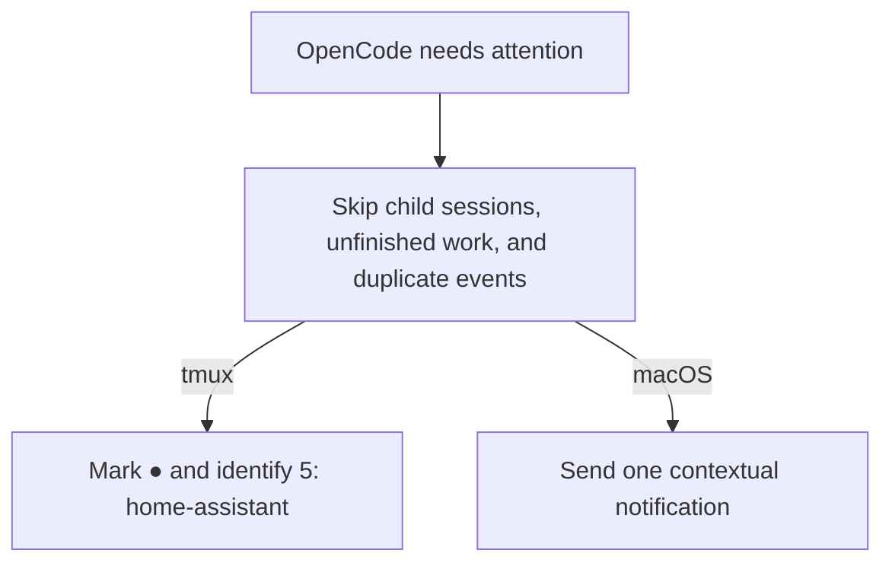

# OpenCode Contextual Notifier

Get a useful alert when OpenCode needs your attention, without being notified for every session
event.

## What it does



Notifications can include the project, session title, latest prompt, latest result, and the
originating tmux window. The plugin handles:

- completed work;
- questions and permission requests;
- plans ready for review;
- session errors.

In tmux, the originating window keeps a `●` marker until you return to it. Without tmux, macOS
notifications continue without the window label or marker. The plugin sends no telemetry.

## Requirements

- OpenCode with the community plugin API (`plugin` in `opencode.json`).
- macOS for Notification Center delivery.
- Optional: tmux 3.2 or newer for attention markers.
- Optional: TPM for the easiest tmux companion installation.

## Install

### 1. Add the OpenCode plugin

Add the npm package to `~/.config/opencode/opencode.json`:

```json
{
  "$schema": "https://opencode.ai/config.json",
  "plugin": ["opencode-contextual-notifier"]
}
```

OpenCode installs npm plugins with Bun on the next startup. Quit and restart every running
OpenCode process after changing the configuration.

### 2. Add the tmux companion (optional)

Add the plugin before the TPM loader at the bottom of `~/.tmux.conf`:

```tmux
set -g @plugin "shmileee/opencode-contextual-notifier"

run "~/.tmux/plugins/tpm/tpm"
```

Press `prefix` + <kbd>I</kbd> to install it. The companion:

- adds the waiting marker to current and non-current window formats once;
- preserves existing window formats and hooks;
- clears the marker when you select the window or focus the tmux client.

Without TPM, clone the repository and source the entrypoint directly:

```tmux
run-shell "/absolute/path/opencode-contextual-notifier/opencode-contextual-notifier.tmux"
```

Reload the tmux configuration after installation. You do not need to restart the tmux server.

### 3. Avoid duplicate Oh My OpenAgent notifications

Oh My OpenAgent includes its own session notification hook. Disable it in your active
`oh-my-openagent.json[c]` or `oh-my-opencode.json[c]` configuration:

```json
{
  "disabled_hooks": ["session-notification"]
}
```

Restart OpenCode after changing the configuration.

## Customize

### Notification sound

The default sound is `Submarine`. Use OpenCode's plugin tuple form to choose another macOS sound:

```json
{
  "$schema": "https://opencode.ai/config.json",
  "plugin": [["opencode-contextual-notifier", { "sound": "Glass" }]]
}
```

### tmux marker

The default marker is `●`. Set `@opencode-notifier-marker` before the TPM loader to change it:

```tmux
set -g @opencode-notifier-marker "!"
```

## How noise filtering works

Before notifying for completed work, the plugin confirms that the session is ready for input. It
skips:

- child sessions;
- sessions with unfinished todos;
- active Oh My OpenAgent continuation work;
- duplicate idle events and repeated updates;
- stale events superseded by newer user activity;
- completion events whose readiness cannot be established safely.

## Development

### Run from source

```bash
git clone https://github.com/shmileee/opencode-contextual-notifier.git
cd opencode-contextual-notifier
bun install
bun run check
bun run build
```

Load the built plugin with an absolute file URL while developing:

```json
{
  "$schema": "https://opencode.ai/config.json",
  "plugin": ["file:///absolute/path/opencode-contextual-notifier/dist/index.mjs"]
}
```

### Validate the package

```bash
bun run check
bun run build
bun pm pack
```

Tests use UUID-scoped tmux sockets and never touch the live tmux server.

## License

MIT
